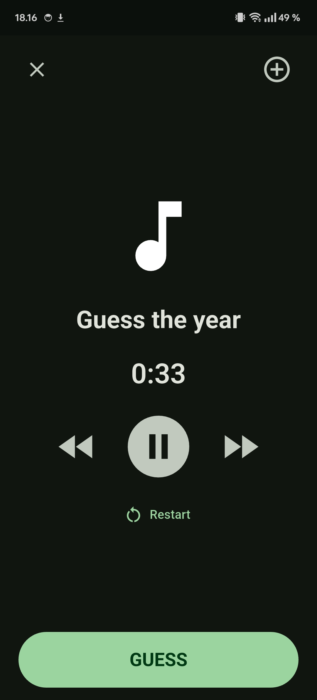

# 🎵 Flutster

A music-timeline party game companion. Scan a QR card, a song plays on **your**
Spotify, and everyone guesses the year it came out — then places it on their
timeline. Plus fast-forward, "start 30s in", and save songs you like.

Two parts:

- **App** (Android, Flutter) — scans cards and controls Spotify playback.
- **Card Maker** (web) — turn any Spotify playlist into printable double-sided cards.

> Flutster brings **your own** free Spotify developer credentials, so it works
> for you and your friends with nothing shared. It ships **no** song data.

<p align="center"></p>

## Features

- 📷 Point-and-scan — opens straight to the camera.
- ▶️ Plays through the official Spotify app (Premium required for playback control).
- ⏪⏩ **Fast-forward / rewind** and an optional **start-30s-in** setting.
- ➕ Save a song to a private "Flutster Songs" playlist.
- 🃏 **Card Maker**: playlist → QR fronts + answer backs, aligned for double-sided printing, with a live songs-per-year balance chart.
- 🔗 **Deck sources**: point the app at a deck-database URL or local file to resolve physical cards (you supply it — the app bundles none).

## Download

Grab the latest signed **APK** from the [**Releases**](../../releases) page and
install it (you may need to allow "install from unknown sources").

## Setup — bring your own Spotify app (~3 min, one-time)

Both the app and the card maker use a free Spotify developer app that **you**
create, so you're never sharing credentials or hitting someone else's limits.

1. Go to **[developer.spotify.com/dashboard](https://developer.spotify.com/dashboard)** → **Create app**.
2. **Redirect URIs** — add both:
   - `flutster://auth` (for the Android app)
   - the card-maker URL you use (`https://nicsilver.github.io/Flutster/` for the hosted site, or `http://127.0.0.1:5173/` if you run it locally)
3. **APIs** — tick **Web API** and **Android**.
4. **Android** — add package `com.nicsilver.flutster` and the release SHA-1:
   `C4:9E:41:2D:B4:7E:C7:0A:53:B8:0A:67:97:42:FB:B6:80:28:F1:F6`
5. **Users and Access** — add your own Spotify account (needs **Premium**).
6. Copy the **Client ID** and paste it into the app's setup screen (and the card maker's).

Requirements: the **Spotify app** installed and a **Spotify Premium** account.

## Card Maker

- **Hosted (free):** https://nicsilver.github.io/Flutster/
- **Local:**
  ```bash
  cd card-maker
  npm install
  npm run dev      # http://127.0.0.1:5173/
  ```

Log in, pick a playlist, and download the **Fronts** (QR) and **Backs** (answers)
PDFs. Print fronts, flip the paper, print backs. The QR codes are plain
`spotify:track:` URIs, so the app scans and plays them directly.

## Build the app from source

```bash
cd app
flutter pub get
flutter run          # debug, on a connected device
```

## A note on data & scope

Flutster is an independent hobby project for personal use. It is **not affiliated
with, endorsed by, or connected to Spotify or any card-game publisher**, and it
**does not include or distribute any game's card database** — you point it at your
own cards or your own deck source. Spotify is a trademark of Spotify AB.

## License

[AGPL-3.0](LICENSE)
