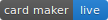
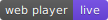
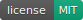
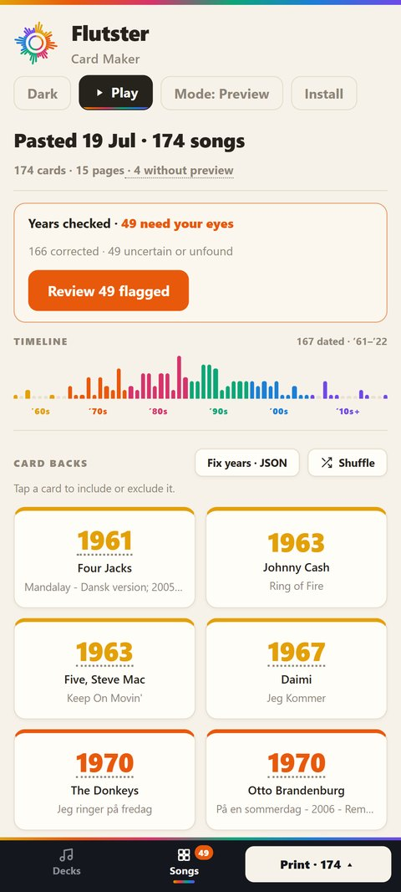
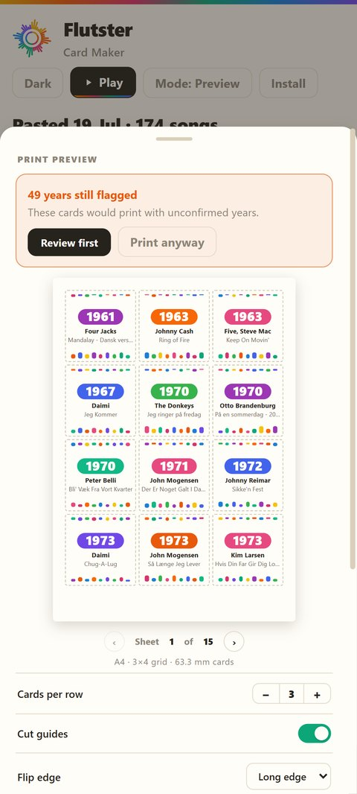
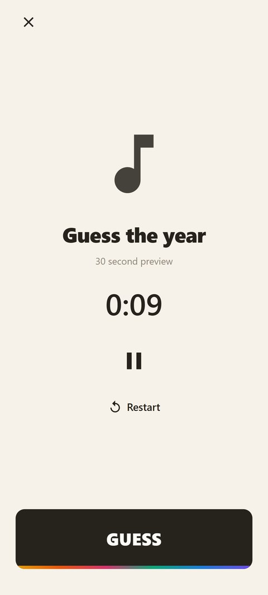

<p align="center">
  
</p>

<p align="center">
  <a href="../../releases/latest"></a>
  <a href="https://nicsilver.github.io/flutster/"></a>
  <a href="https://nicsilver.github.io/flutster/#play"></a>
  <a href="LICENSE"></a>
</p>

Flutster is a complete kit for music-timeline party games. Print your own decks of QR song cards, then scan a card and the song plays without revealing itself. Everyone guesses the year, the card lands on the timeline, first full timeline wins.

It comes in three pieces, all free:

- **[Card Maker](https://nicsilver.github.io/flutster/)** (web). Turns any set of songs into printable double-sided cards, with the release years fact-checked for you.
- **App** (Android, Flutter). Scans cards and plays the songs, built for passing around the table.
- **[Web player](https://nicsilver.github.io/flutster/#play)**. The same scan-and-play in any browser, nothing to install. This is how iPhone players join.

No servers, no shared accounts, no bundled song data. Cards encode plain `spotify:track:` URIs, so every deck you print works in every mode, including modes that did not exist when you printed it.

## Two modes

The card maker and both players work in one of two modes, chosen on first visit and switchable any time:

| | **Spotify mode** | **Preview mode** |
|---|---|---|
| Setup | Your own free Spotify developer app + Premium | None |
| Input | Your playlists, playlist links, or pasted songs | Songs copied from any Spotify playlist (Ctrl+A, Ctrl+C, paste) |
| Song data | Full Spotify metadata incl. ISRC | Title and artist via a small public metadata mirror |
| Year verification | MusicBrainz, Discogs, iTunes | The same |
| Playback | Full songs through Spotify | 30-second iTunes preview clips; cards without one are tagged before you print |
| Printed cards | Identical in both modes | Identical in both modes |

Preview mode exists because Spotify has paused new developer app signups: without a developer app you cannot use Spotify mode, but you can still build, verify, print, and play a full deck with zero accounts. The metadata mirror is a tiny [Cloudflare Worker](card-maker/worker/meta-worker.js) that only reads public Spotify pages and holds no credentials of any kind.

## Screenshots

<p align="center">
  
  
  
  
</p>

<p align="center">
  
</p>

<p align="center">
  
  
  
</p>

<p align="center">
  
</p>

## The Card Maker

### Build a deck

- Load your Spotify playlists, paste a playlist link, or just select songs in Spotify (Ctrl+A, Ctrl+C) and paste them anywhere on the page. Pasted decks are remembered for later reprints.
- A decade-colored timeline and per-playlist era fingerprints show a deck's balance at a glance.
- Tap any card to include or exclude it, shuffle the deck, or cap the number of songs per year so one era cannot dominate the game.

### Get the years right

- Spotify often reports a remaster or compilation date instead of the original release, so every card's year is verified in the background against MusicBrainz, Discogs, and iTunes. Confident corrections apply automatically.
- Anything uncertain lands in a review screen that states, in one sentence per song, what the sources disagree about, with a one-click lookup and an editable year.
- Fixing many years at once? Export them as JSON, let an AI assistant correct the batch, and import the result.

### Print

- Fronts are vector QR codes, pixel-identical on every card so nobody can memorize them. Backs carry the artist, a big year, and the title, each card colored by a hash of the track so nothing on the card hints at the year.
- Three ink levels: Colour, B&W ink saver, and Minimal.
- Optional deck label printed along both side edges of each front, so mixed decks sort apart in seconds.
- Live A4 sheet preview, cut guides, and mirrored backs for hand-duplex printing: print the fronts, flip the stack, print the backs.
- Print tracking remembers what you already printed, shows what is new or changed since, filters the PDFs down to just those cards, and flags printed cards whose year was corrected afterwards.
- In Preview mode, songs without a 30-second clip are tagged before you print, so silent cards never reach the table.

### On a phone

The card maker reshapes into a docked app on small screens, with Decks and Songs tabs and a slide-up print sheet. It also installs as an app: one tap on Android and desktop, add-to-home-screen on iOS.

## Playing

### Android app

- Opens straight into the camera and runs full screen, bars hidden, like a game should.
- Plays through the official Spotify app, with rewind, fast-forward, restart, and an optional "start 30 seconds in" that skips long intros.
- One tap saves the current song to a private playlist; tap again to remove it.
- Works without any Spotify at all: in preview mode, scans play a looping 30-second clip.

### Web player

[nicsilver.github.io/flutster/#play](https://nicsilver.github.io/flutster/#play) scans cards with the camera and plays them blind, on phones and laptops alike.

- Preview clips need no login. Full songs play on your Spotify when logged in, and an idle Spotify device is woken automatically.
- Keyboard controls for couch play: space to guess, arrow keys to seek and pause.

### Decks from other games

If a card's QR encodes a card number instead of a song link (official Hitster-style decks), point Flutster at a deck database that maps numbers to tracks: in the app under Settings, or on the web player under Sources. Communities maintain such databases for the popular games. You supply the source; Flutster bundles none.

## Quick start

**Playing tonight, cards in hand?** Install the [latest APK](../../releases/latest) on Android, or open the [web player](https://nicsilver.github.io/flutster/#play) on any phone. Pick Preview mode and you need no accounts at all.

**Making a deck?** Open the [Card Maker](https://nicsilver.github.io/flutster/), choose Preview mode, copy the songs out of any Spotify playlist, paste, review the flagged years, and download the two PDFs.

## Spotify mode setup

Full-song playback runs on a free Spotify developer app that you create yourself, so you never share credentials or hit someone else's limits. Note that Spotify has currently paused new developer app signups; if you cannot create one, use Preview mode. If you already have one:

1. Go to [developer.spotify.com/dashboard](https://developer.spotify.com/dashboard) and press **Create app**.
2. Under **Redirect URIs**, add both:
   - `flutster://auth` for the Android app
   - the card-maker URL you use: `https://nicsilver.github.io/flutster/` for the hosted site, or `http://127.0.0.1:5173/` if you run it locally
3. Under **Which API/SDKs**, tick **Web API** and **Android**.
4. Under **Android packages**, add the package `com.nicsilver.flutster` with the release SHA-1:
   `C4:9E:41:2D:B4:7E:C7:0A:53:B8:0A:67:97:42:FB:B6:80:28:F1:F6`
5. Under **Users and Access**, add your own Spotify account (needs **Premium**).
6. Copy the **Client ID** and paste it into the app's setup screen (the card maker asks for the same ID).

The app walks you through all of this on first launch.

## Development

Card maker (Vite + React):

```bash
cd card-maker
npm install
npm run dev      # http://127.0.0.1:5173/
npm test         # vitest; also runs in CI before every deploy
```

The test suite locks the printed-card identity (colors, deck keys, grid geometry), so a refactor cannot silently make reprints mismatch decks already on the table.

App (Flutter):

```bash
cd app
flutter pub get
flutter run      # debug build on a connected device
```

Tagging `v*` builds a signed APK and publishes a GitHub release; pushes touching `card-maker/` test and deploy the site.

## Data and scope

Flutster is an independent hobby project for personal use. It is not affiliated with, endorsed by, or connected to Spotify or any card-game publisher, and it does not include or distribute any game's card database. You point it at your own cards or your own deck source. Spotify is a trademark of Spotify AB.

## License

[AGPL-3.0](LICENSE)
