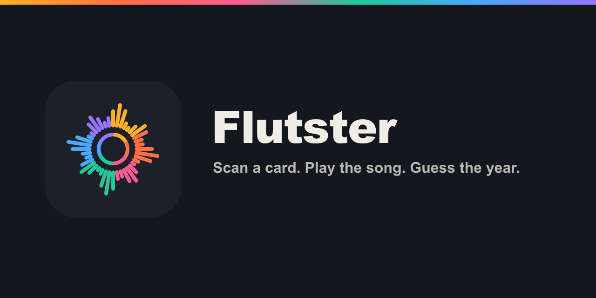
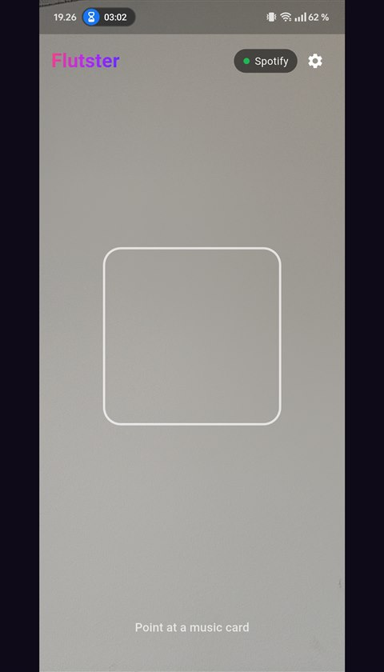
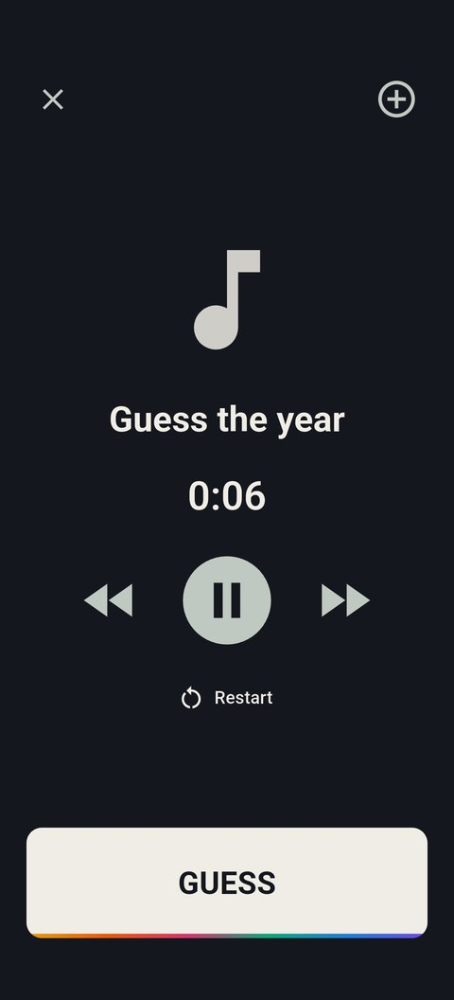
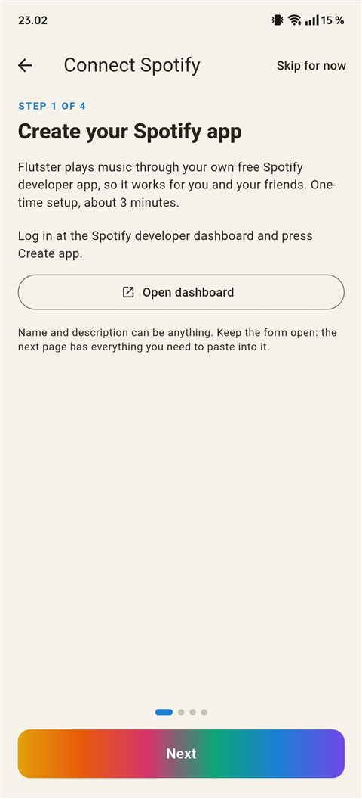
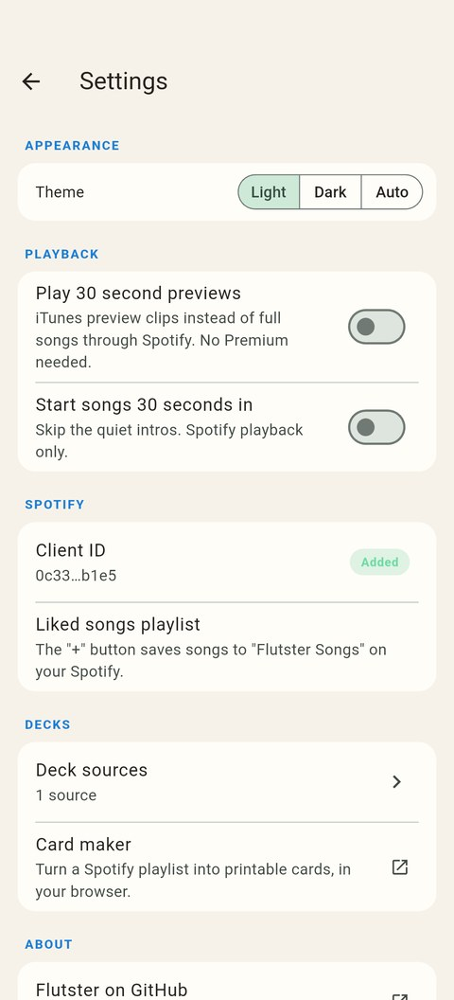
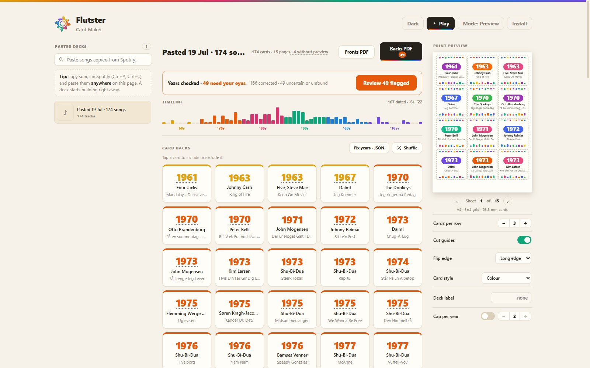
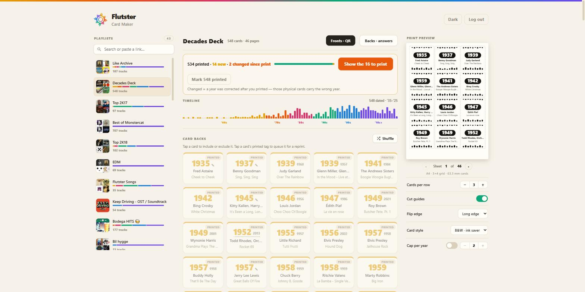
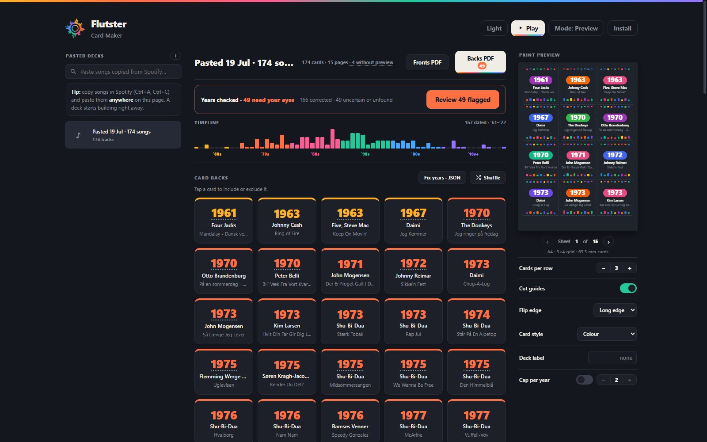

<p align="center">
  
</p>

<p align="center">
  <a href="../../releases/latest"></a>
  <a href="LICENSE"></a>
  <a href="https://nicsilver.github.io/flutster/"></a>
</p>

Flutster is a companion app for music-timeline party games. Scan the QR code on a card and the song plays on your own Spotify. Everyone guesses the year it came out, then places it on their timeline.

It has two parts:

- **App** (Android, Flutter): scans cards and controls Spotify playback.
- **[Card Maker](https://nicsilver.github.io/flutster/)** (web): turns any Spotify playlist into printable double-sided cards.

Flutster runs on **your own** free Spotify developer credentials, so it works for you and your friends with nothing shared, no accounts, and no servers. It ships **no** song data.

## Two modes

The card maker offers two ways to build a deck, chosen on first visit and switchable from the top bar:

| | **Spotify mode** | **Preview mode** |
|---|---|---|
| Setup | Your own free Spotify developer app + Premium | None |
| Input | Your playlists, playlist links, or pasted songs | Songs copied from any Spotify playlist (Ctrl+A, Ctrl+C, paste) |
| Song data | Full Spotify metadata incl. ISRC | Title and artist via a small public metadata mirror |
| Year verification | MusicBrainz, Discogs, iTunes | The same |
| Playback | Full songs through Spotify (Flutster app) | 30-second iTunes preview clips; cards without one are tagged before you print |
| Printed cards | Identical in both modes | Identical in both modes |

Preview mode exists because Spotify has paused new developer app signups: without a developer app you cannot use Spotify mode, but you can still build, verify, and print a full deck with zero accounts. The metadata mirror is a tiny [Cloudflare Worker](card-maker/worker/meta-worker.js) that only reads public Spotify pages and holds no credentials of any kind.

## Screenshots

<p align="center">
  
  
  
  
</p>

<p align="center">
  
</p>

<p align="center">
  
  
</p>

## Features

- Opens straight to the camera. Point at a card and the song plays.
- Plays through the official Spotify app (Premium required for playback control).
- Fast-forward, rewind, restart, and an optional "start 30 seconds in" setting that skips long intros.
- Saves songs you like to a private "Flutster Songs" playlist with one tap; tap again to remove.
- Card Maker turns any playlist into printable double-sided cards: QR fronts, designed answer backs (each card gets its own colors, hashed from the track so nothing hints at the year), in colour or an ink-saving black and white.
- A decade-colored timeline and per-playlist "era fingerprints" show a deck's balance before you print; a live sheet preview shows exactly what comes out of the printer.
- Year verification: Spotify often reports a remaster or compilation date instead of the original release, so every card's year is checked against MusicBrainz, Discogs, and iTunes. Corrections apply automatically; anything uncertain is flagged for a quick review before you print.
- Print tracking: the card maker remembers what you've already printed, shows what's new since the last print, filters the PDFs down to just those cards, and resurfaces printed cards whose year was later corrected.
- Light and dark themes across app and web.
- Play in any browser, no app: [nicsilver.github.io/flutster/#play](https://nicsilver.github.io/flutster/#play) scans cards with the camera and plays them blind. 30 second preview clips with no accounts, or full songs on your active Spotify device when you are logged in. Works on phones and laptops, which also covers iPhone players.
- Plays cards from other games too. If your cards' QR codes are not direct Spotify links (official Hitster-style decks encode a card number instead), point the app at a deck database that maps card numbers to tracks, via a URL or a local file, under Settings → Deck sources. Communities maintain such databases for the popular games; search for your gameset's card database. You supply the source; the app bundles none.
- Optional deck label: a small tag printed along each card back's edge, so cards from different printed decks can be sorted apart when they get mixed.

## Download

Grab the latest signed APK from the [Releases](../../releases/latest) page and install it. You may need to allow installing from unknown sources.

## Setup: bring your own Spotify app

Both the app and the card maker use a free Spotify developer app that you create yourself, so you never share credentials or hit someone else's limits. It takes about three minutes, once, and the app walks you through it on first launch:

1. Go to [developer.spotify.com/dashboard](https://developer.spotify.com/dashboard) and press **Create app**.
2. Under **Redirect URIs**, add both:
   - `flutster://auth` for the Android app
   - the card-maker URL you use: `https://nicsilver.github.io/flutster/` for the hosted site, or `http://127.0.0.1:5173/` if you run it locally
3. Under **Which API/SDKs**, tick **Web API** and **Android**.
4. Under **Android packages**, add the package `com.nicsilver.flutster` with the release SHA-1:
   `C4:9E:41:2D:B4:7E:C7:0A:53:B8:0A:67:97:42:FB:B6:80:28:F1:F6`
5. Under **Users and Access**, add your own Spotify account (needs **Premium**).
6. Copy the **Client ID** and paste it into the app's setup screen (the card maker asks for the same ID).

You also need the Spotify app installed and a Spotify Premium account.

## Card Maker

- Hosted, free: https://nicsilver.github.io/flutster/
- Local:

  ```bash
  cd card-maker
  npm install
  npm run dev      # http://127.0.0.1:5173/
  ```

Log in, pick a playlist, and download the fronts (QR codes) and backs (answers) as PDFs. Print the fronts, flip the paper, print the backs. The QR codes are plain `spotify:track:` URIs, so the app scans and plays them directly.

## Build the app from source

```bash
cd app
flutter pub get
flutter run          # debug build on a connected device
```

## Data and scope

Flutster is an independent hobby project for personal use. It is not affiliated with, endorsed by, or connected to Spotify or any card-game publisher, and it does not include or distribute any game's card database. You point it at your own cards or your own deck source. Spotify is a trademark of Spotify AB.

## License

[AGPL-3.0](LICENSE)
